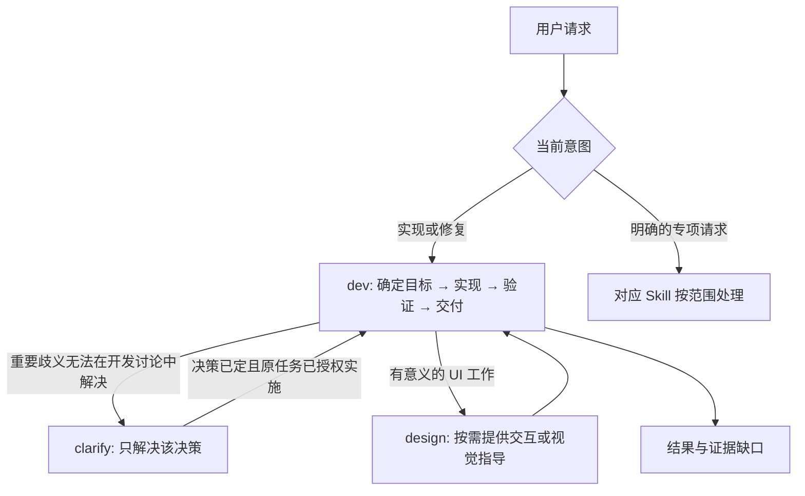

# 从请求到证据的工作流程

## 入口与执行中的决策

普通实现、修复和补开发测试进入 `dev`；明确的产品判断、设计、业务 QA、最终验收和偏好记录请求进入对应 Skill。入口不预演后续所有阶段。

QA 和单独验收不会因为“任务重要”或“证据不足”自动成为下一站。用户明确要求“实施后做独立 QA”时，两部分可在同一任务中顺序完成。`dev` 自己完成相称的验证。只读或只出方案的任务保持原范围；修复已在原请求中获得授权时，可结束只读阶段后直接进入实施；否则等待用户要求修复。Skill 切换不重置已给出的授权，也不授权新的发布、生产操作或外部 Agent。

## 信息放在哪里

- `AGENTS.md`：本仓库规则；`CLAUDE.md` 引用它。
- Skill 的 `description`：独立可理解的能力与关键入口条件。
- `when_to_use`：补充措辞和上下文，不承载只在这里出现的关键授权边界。
- Skill 正文：执行决策和完成条件。参考文件只补充该情境独有的技术信息，不再复制一遍开发流程。

`clarify` 明确区分 intake 与 delivery：前者是用户主动要求判断，后者是 `dev` 在真实工作中发现重要决策。路由 fixtures 分别提供阶段和已有上下文，评估提示词不额外指定哪个 Skill 应被选中。

## 验收的三个事实

| 维度 | 需要说明 | 不能推出什么 |
| --- | --- | --- |
| 审查者分离 | 同一实现者、新上下文、另一 Agent 或人类 | 另一 Agent 不代表验证充分 |
| 验证证据 | 检查对象、结果、时效及覆盖缺口 | 自动化通过不代表独立审查 |
| 批准权限 | 谁能批准相关操作、已批准/待批准/不适用 | 技术 accepted 不授权发布 |

这三个维度不设高低等级，也不默认要求更多 Agent 或人工审批。

## 评估与可复核结果

- **静态检查**：结构、fixture 加载、适配器同步、安装安全、校验器自身的正反例。
- **路由代理评估**：默认仅 description；`--surface extended` 明确加入 when_to_use。报告注明输入面和阶段，不冒充真实宿主发现机制。
- **回答契约评估**：仍用于字段、枚举和禁止措辞的低成本检查，不证明文件操作或任务完成。
- **宿主自报冒烟**：检查实际 CLI 声称会选哪个 Skill，不能证明它实际加载和执行了该 Skill。
- **真实执行评估**：临时项目中完成实现、只读审查和已授权继续任务；外部校验器检查文件变化和可观察行为，调用方检查真实回复是否重复确认或虚报。

路由首次结果决定 strict 用例是否失败；`--recheck` 只加诊断结果。回答评估默认一次，`--attempts 2` 或 `3` 保留全部回答，首次失败仍失败。`--record` 写 Markdown 摘要及 JSON 原始回答。运行错误也属于失败。历史报告保持原样，旧分数不能直接与新口径比较。

### 真实执行复现

1. 运行 `npm run eval:execution -- --prepare`，取得新的临时目录。
2. 在已获授权的宿主原生 Agent 或用户指定 CLI 中，分别执行该目录下的三个 `*.task.txt`。每个用例使用独立上下文，只提供对应任务文件，不提供 manifest 或校验器。不要用本轮预期答案指导它。
3. 调用方将实际最终回复原样保存为同目录的 `<case>.response.txt`。检查 Agent 运行记录；文件验证不能检测一次写入后又撤销、非阻塞确认问题或进程越界。
4. 运行 `npm run eval:execution -- --verify <临时目录>`。结果追加到 `attempts.jsonl`；每次新的模型尝试重新 prepare，避免沿用已修复文件。归档时记录宿主、实际可知的模型/版本、Skill 哈希、尝试次数、回复和验证结果。

prepare 和 verify 不自动启动外部 Agent，不修改全局 Skills。测试项目无依赖、无网络需求，允许的文件范围写入任务说明。它是行为评估工作区，不是安全隔离沙箱；仅在可信且已授权的 Agent 环境中运行。三个小场景只能提供局部证据，不能证明所有宿主的路由或完整的多轮澄清过程。
